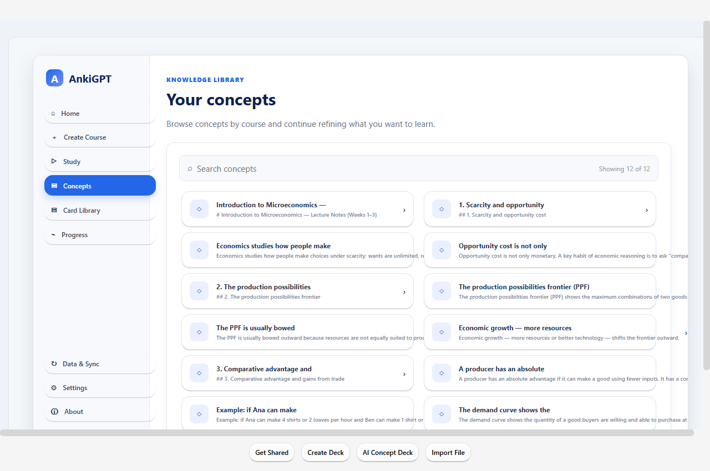
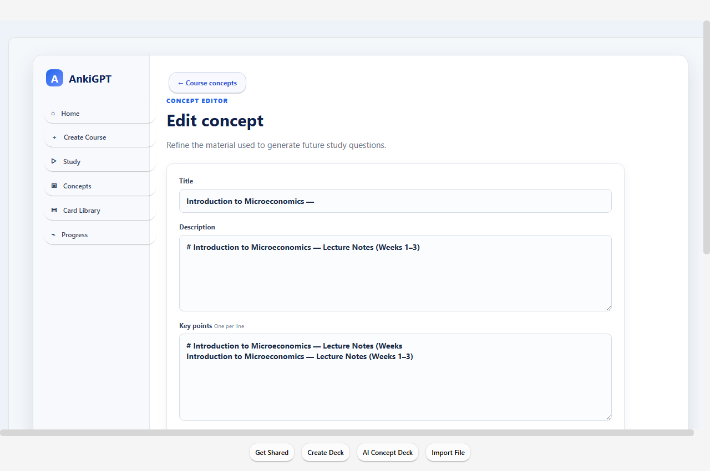
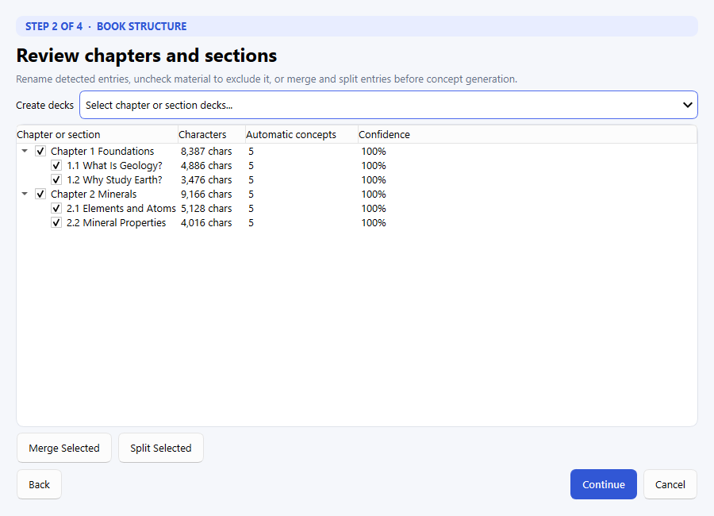
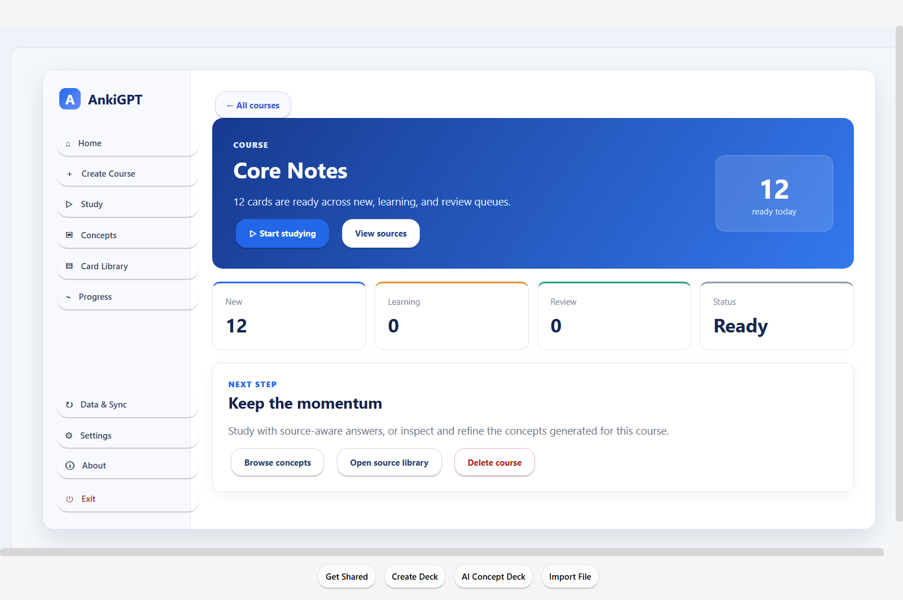
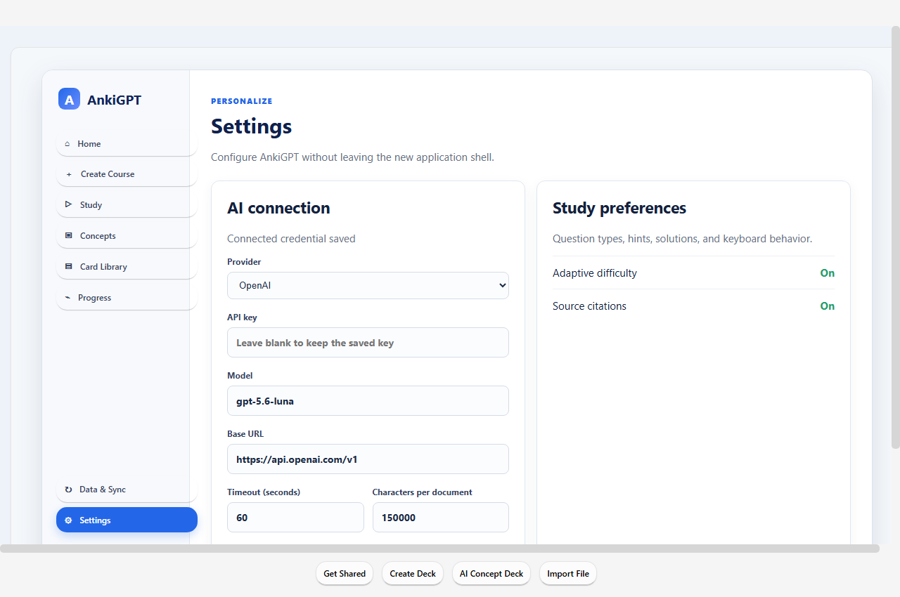
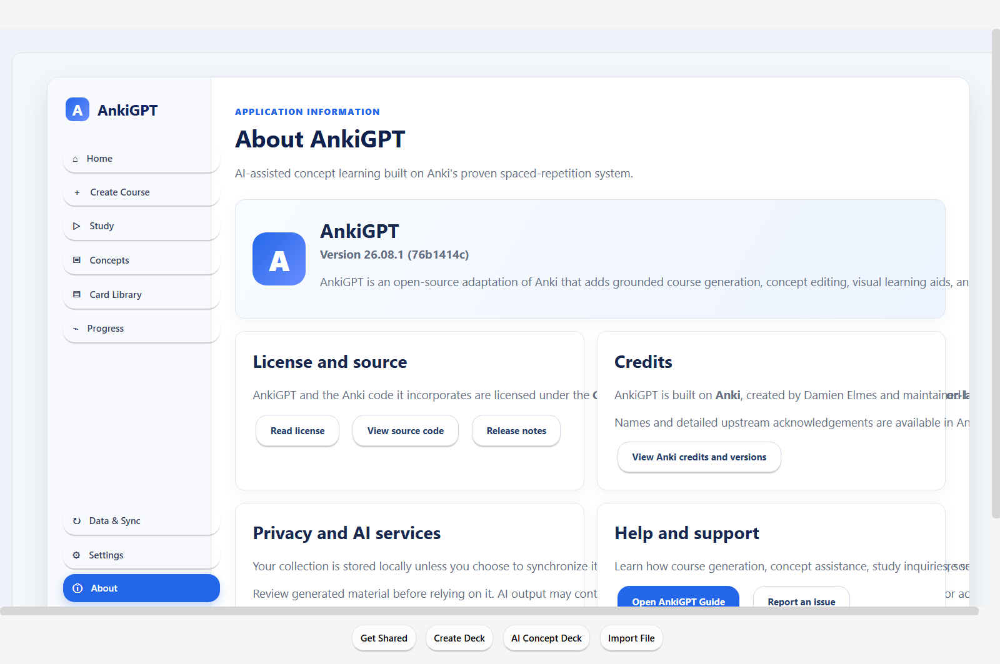

# AnkiGPT

AnkiGPT turns course documents into editable concepts and uses those concepts
to create adaptive study questions inside a complete spaced-repetition
application. It combines Anki's scheduling and collection tools with
source-grounded AI assistance throughout course creation, concept editing,
and studying.

This repository is maintained at
[`mando1967/ankigpt`](https://github.com/mando1967/ankigpt). It is derived
from [`superj6/ankigpt`](https://github.com/superj6/ankigpt) and
[`ankitects/anki`](https://github.com/ankitects/anki).

## What it does

- Creates concept decks from PDF, DOCX, Markdown, plain-text, folder, and web
  sources.
- Organizes decks as **category → subcategory → deck** and presents the
  hierarchy as a selectable accordion in Open, Study, and Edit modes.
- In book mode, places the book automatically under the selected course or
  subject as its subcategory, detects its structure, and lets the user review
  and adjust it before choosing one deck per chapter or one deck per section.
- For non-book sources, requires a subcategory and lets the user combine
  multiple documents into one deck or create a separate deck for each
  document.
- Filters and organizes source material before proposing concepts.
- Lets the student review, edit, improve, or delete generated concepts.
- Generates source-aware self-graded, typed-answer, and multiple-choice study
  questions.
- Provides contextual **Ask AI** assistance while editing and studying.
- Supports attached images and AI-generated visual aids for concepts.
- Shows the passages used to form a question and opens them in context.
- Retains Anki scheduling, profiles, synchronization, backup, import, export,
  database checks, and media management.

## Application tour

The screenshots below come from the running application and its sample
microeconomics course.


| Browse the concept library | Refine a concept in the Study Hub |
| --- | --- |
|  |  |

| Configure course generation | Review detected book structure |
| --- | --- |
|  |  |

| Monitor extraction progress | Review concepts before creating decks |
| --- | --- |
|  |  |

| Open a course and choose the next action | Configure AI securely in Settings |
| --- | --- |
|  |  |

| Study with an AI-generated question | Receive feedback and a suggested rating |
| --- | --- |
|  |  |

Licensing, upstream credits, privacy guidance, version information, and
support links are available without leaving the application.



## Install on Windows

Download the latest MSI from the repository's
[Releases page](https://github.com/mando1967/ankigpt/releases), then run the
installer. The packaged application includes Python, Qt, and the native
runtime; users do not need to install the developer toolchain.

Current community installers may be unsigned. Windows can consequently show
an unknown-publisher or SmartScreen warning. Verify that the installer came
from this repository's Releases page before running it.

AI features require a supported provider account and API credential. Core
Anki features can operate locally without an AI connection.

## First-time setup

1. Start AnkiGPT and open **Settings**.
2. Select OpenAI or another OpenAI-compatible provider.
3. Enter the API key, model, base URL, and timeout, then test the connection.
4. Choose **Create Course**, attach source files, and describe the desired
   scope, level, emphasis, and exclusions.
5. Review the proposed concepts before adding them to the course.
6. Open a course and start studying.

Clear guidance improves extraction. For example:

> First-year statics. Focus on free-body diagrams, equilibrium equations,
> moments, and common sign-convention errors. Exclude administrative
> instructions and quiz formatting.

## AI and source handling

AnkiGPT does not need to treat every line of an uploaded document as a study
fact. Its extraction pipeline plans larger documents, retrieves relevant
sections, rejects low-value instructional or administrative text, and creates
clean concepts for review. Students retain final control over every concept.

During study, questions are generated from the concept, its key points, and
retrieved source passages. Recently asked questions are recorded in the local
`ankigpt.sqlite` sidecar database to reduce repetition.

When an AI feature is used, relevant prompts and study content are sent to the
provider configured in Settings. The provider's privacy, retention, and usage
terms apply. Generated output can contain errors and should be reviewed,
especially for high-stakes subjects.

## Building from source

The project uses Anki's pinned build environment. Build and run it from the
repository root with:

```powershell
just run
```

See [Anki development documentation](docs/development.md) for the complete
toolchain and platform prerequisites. The AnkiGPT implementation is primarily
under `qt/aqt/ankigpt/`, with tests under `qt/tests/test_ankigpt_*.py`.

For deterministic local development without an external provider:

```powershell
$env:ANKIGPT_FAKE_LLM = "1"
just run
```

## Windows MSI builds

The [AnkiGPT Windows MSI workflow](.github/workflows/ankigpt-windows-msi.yml)
builds a self-contained Windows x64 installer.

- Run **Actions → AnkiGPT Windows MSI → Run workflow** for a test artifact.
- Push a tag such as `ankigpt-v1.0.0` to build an MSI and publish a GitHub
  Release automatically.
- Locally generated installers are written to `out/installer/dist/`.
- The repository's `release/` directory can hold local copies; its artifacts
  are ignored by Git.

Do not commit MSI binaries to the repository. Publish them as GitHub Release
assets so they remain outside Git history.

## Testing

Run the AnkiGPT Python tests with the project's `just` recipes:

```powershell
just test-py
```

The offscreen application check and screenshot harness are available at
`tools/ankigpt_smoke.py` and `tools/ankigpt_screenshots.py`.

## Licensing and credits

AnkiGPT and the Anki code it incorporates are licensed under the
[GNU Affero General Public License, version 3 or later](LICENSE).

Anki was created by Damien Elmes and is maintained by Ankitects and
contributors. See [CONTRIBUTORS](CONTRIBUTORS) and the in-application
**About AnkiGPT** and **Anki credits and versions** pages for additional
acknowledgements, version information, privacy guidance, source links, and
support resources.
