# AnkiGPT

AnkiGPT is a fork of [Anki](https://apps.ankiweb.net) in which the unit of
study is a **concept** rather than a fixed card. Anki's FSRS scheduler decides
which concepts are due; when one comes up, a question is generated on the fly
by an OpenAI-compatible LLM from the concept's summary and source excerpts,
adapted to how well you already know it. Concept decks are built by uploading
course documents (PDF, DOCX, Markdown, text) plus a short prompt.

Everything else in Anki (normal decks, sync, browser, stats) is unchanged.

## What it looks like

Real screenshots of the app (rendered by `tools/ankigpt_screenshots.py` from
[`docs/ankigpt/sample-course.md`](docs/ankigpt/sample-course.md), questions
and grades generated by the model).

| Build a deck from your documents                                           | Review the proposed concepts                                           |
| -------------------------------------------------------------------------- | ---------------------------------------------------------------------- |
| 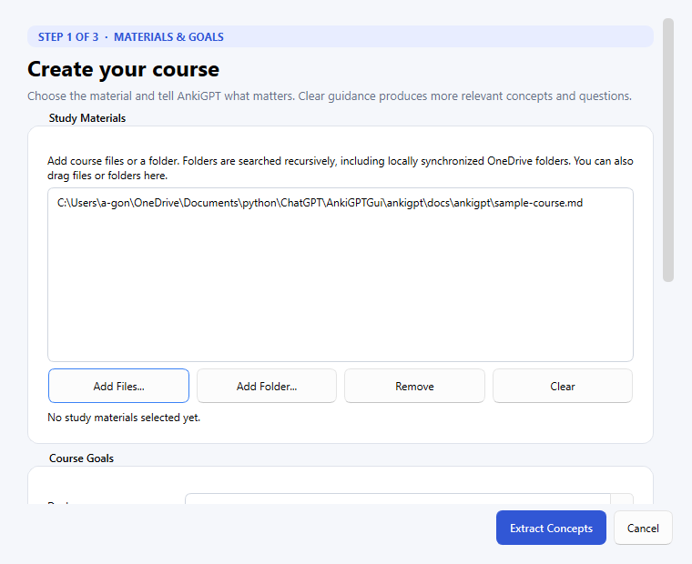 | 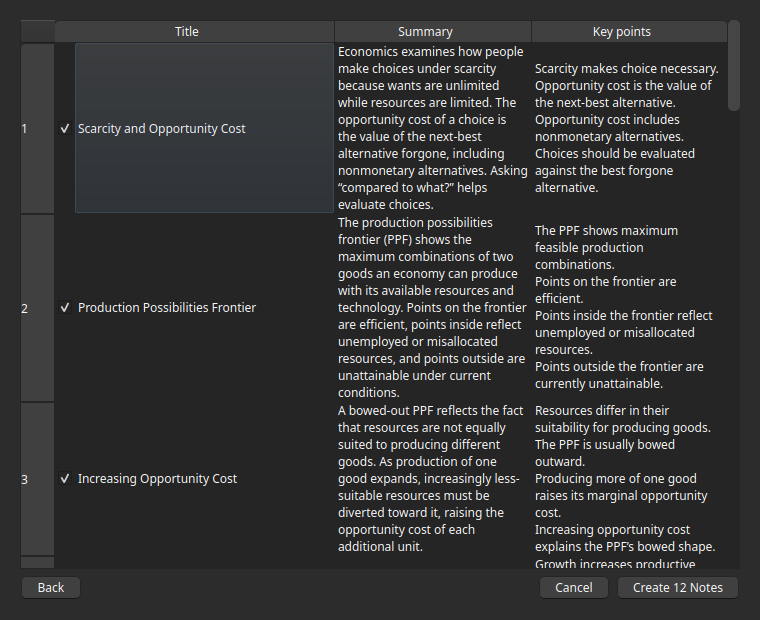 |

| A question generated for the concept that is due                       | Your typed answer, graded                                                             |
| ---------------------------------------------------------------------- | ------------------------------------------------------------------------------------- |
| 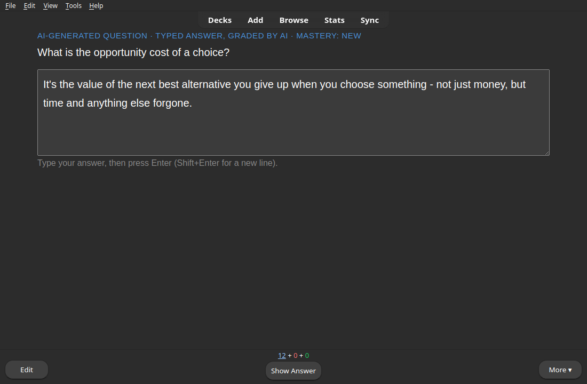 | 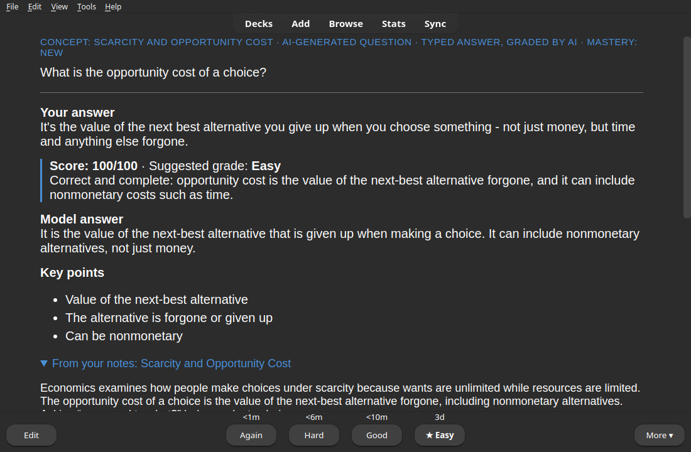 |

| Multiple choice mode                                                    | The deck, in the normal Anki deck list                                              |
| ----------------------------------------------------------------------- | ----------------------------------------------------------------------------------- |
| 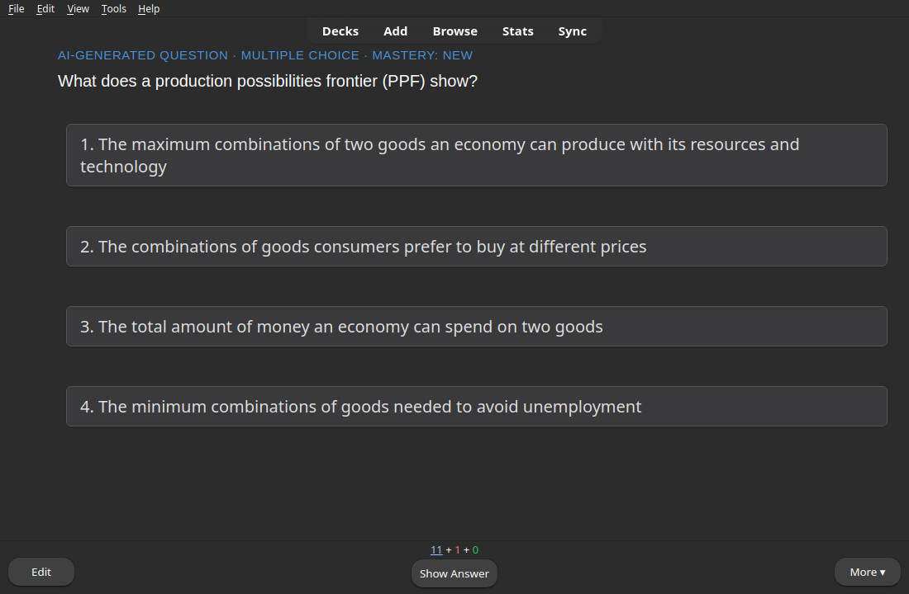 | 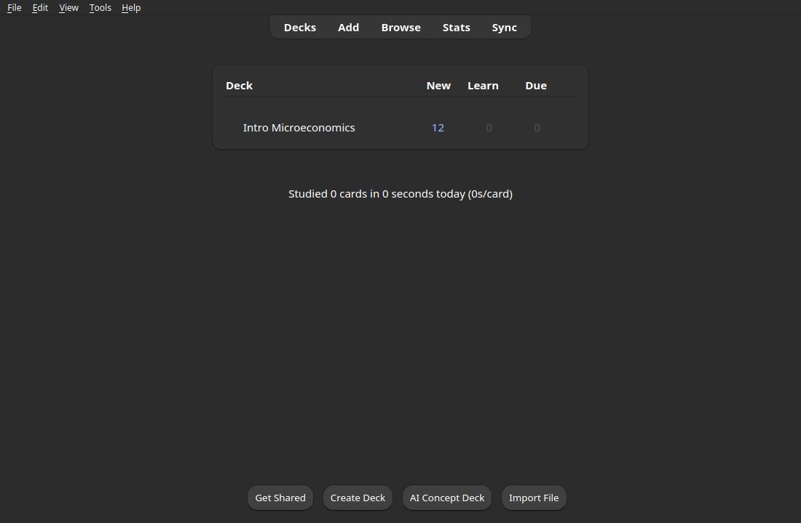 |

| Concept deck overview                                                    | Per-deck settings                                                                                                               |
| ------------------------------------------------------------------------ | ------------------------------------------------------------------------------------------------------------------------------- |
| 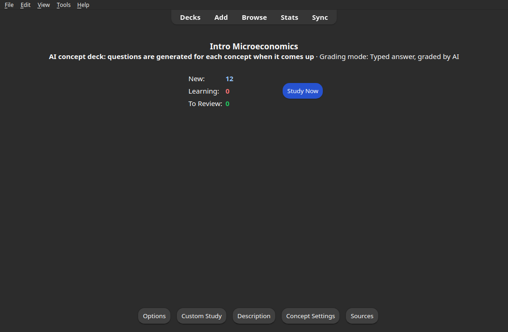 | 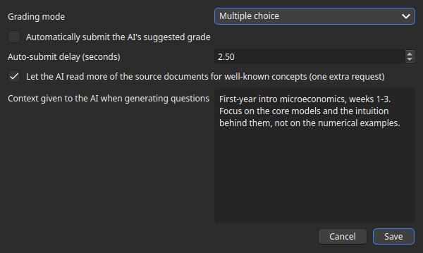 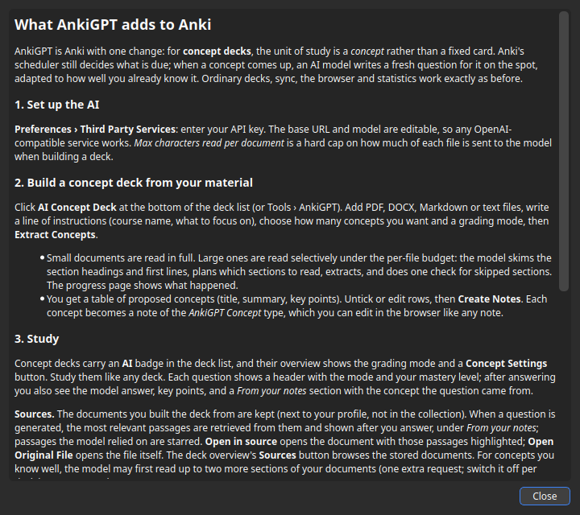 |

After answering, the passages the question drew on are listed with an
**Open in source** link that opens the stored document with those passages
highlighted:

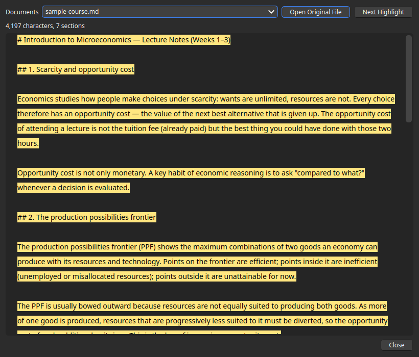

Extraction progress is shown live in the dialog (what was read, how each
large document was planned, candidates found so far):

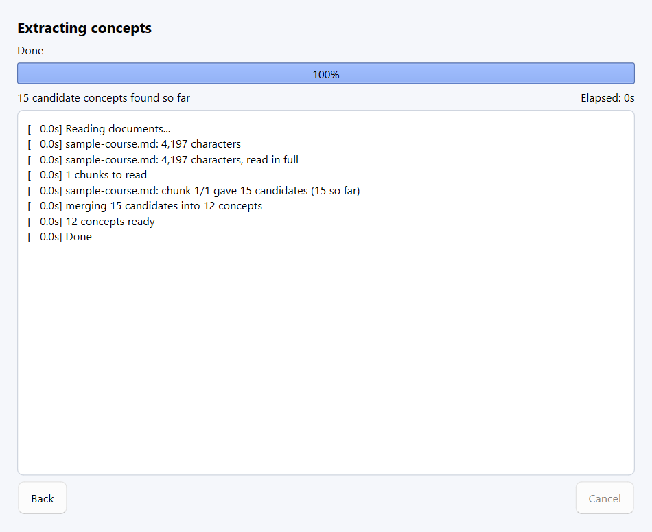

## Using it

1. Build and run as described in [Development](./docs/development.md)
   (`just run`).
2. Preferences > Third Party Services: enter your API key. The base URL and
   model are editable, so any OpenAI-compatible endpoint works.
3. Click **AI Concept Deck** at the bottom of the deck list (or Tools >
   AnkiGPT > Create Concept Deck from Documents...): add files, write
   instructions (course name, what to focus on), pick a grading mode, extract,
   review the proposed concepts, and create the deck. Large documents are
   read selectively under a per-file budget: the model skims the section
   headings and picks what to read (Preferences > Third Party Services).
4. Study the deck like any other. Grading modes (per deck: the **Concept
   Settings** button on the deck overview, or Tools > AnkiGPT):
   - **Self-grade**: the usual Again/Hard/Good/Easy buttons.
   - **Typed answer**: type an answer, the LLM grades it and pre-selects a
     button; Enter/Space accepts, 1-4 overrides. Optional auto-submit.
   - **Multiple choice**: four options, auto-graded (click or press 1-4).
   - **Random mix** of the three.
     After answering you see the model answer, key points, and a _From your
     notes_ section: the concept the question was generated from and the
     passages retrieved from your documents for it (starred if the model used
     them), each with an _Open in source_ link to the highlighted passage in
     the stored document. The documents you built a deck from are kept next
     to your profile; questions retrieve the most relevant passages from them
     (lexical search, no extra API cost), and for well-known concepts the
     model may read up to two more sections before writing an applied or
     transfer question (one extra request, switchable in Concept Settings).
     Concept decks carry an **AI** badge in the deck list, and **Help >
     AnkiGPT Guide** explains everything in-app.

Recently asked questions per concept are kept in `ankigpt.sqlite` next to your
profile so new questions do not repeat them. If no API key is set or the API
fails, reviewing a concept deck stops with an error.

Set `ANKIGPT_FAKE_LLM=1` to run without network (deterministic fake answers),
e.g. `ANKIGPT_FAKE_LLM=1 just run -b /tmp/ankigpt-base`. An end-to-end check
that boots the app offscreen lives in `tools/ankigpt_smoke.py`;
`tools/ankigpt_screenshots.py` regenerates the screenshots above.

## Where the code lives

- `qt/aqt/ankigpt/` - all AnkiGPT code (`review.py` is the reviewer
  integration; `generate_dialog.py` + `extract.py` build decks;
  `store.py` is the sidecar database).
- `ftl/qt/ankigpt.ftl` - UI strings.
- Upstream files touched: `qt/aqt/reviewer.py` (four hook lines),
  `qt/aqt/main.py`, `qt/aqt/preferences.py`, `qt/pyproject.toml`/`uv.lock`.
- Tests: `qt/tests/test_ankigpt_*.py`.

---

# Anki

This repo contains the source code for the computer version of
[Anki](https://apps.ankiweb.net).

## About

Anki is a spaced repetition program. Please see the [website](https://apps.ankiweb.net) to learn more.

## Getting Started

### Contributing

Want to contribute to Anki? Check out the [Contribution Guidelines](./docs/contributing.md).

For more information on building and developing, please see [Development](./docs/development.md).

#### Contributors

The following people have contributed to Anki: [CONTRIBUTORS](./CONTRIBUTORS)

### Anki Betas

If you'd like to try development builds of Anki but don't feel comfortable
building the code, please see [Anki betas](https://betas.ankiweb.net/).

## License

Anki's license: [LICENSE](./LICENSE)
